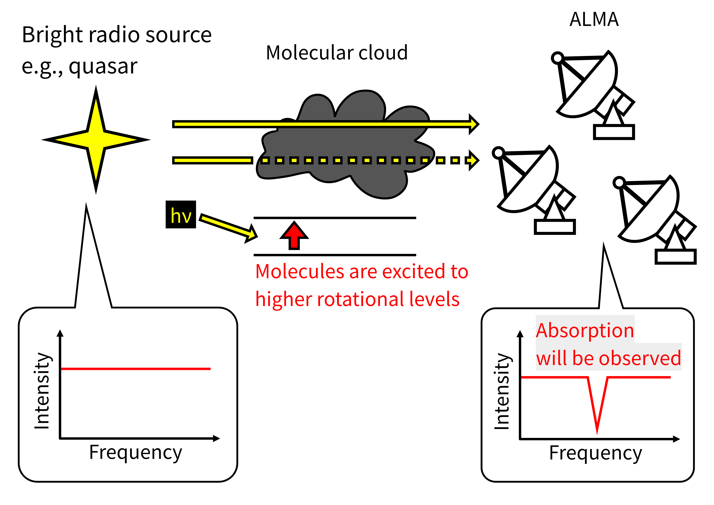

Introduction
========================

`almaqso` is a Python package to download, process and analyze bunch of calibration data observed by ALMA automatically.
It is designed to collaborate with assets of ALMA community such as CASA, analysisUtils of CASA, ALMA Science Archive, and so on.

This project was originally developed by Yuki Yoshimura and the repository can be found at https://github.com/astroysmr/almaqso.

Why almaqso?
------------------------

`almaqso` was originally developed to study the galactic molecular clouds.
When quasi-stellar objects (QSOs) that are observed as calibration sources by ALMA are located behind the molecular clouds, the calibration data can contain the absorption features caused by them.
By analyzing such absorption features, we can investigate the physical and chemical properties of the molecular clouds.

However, since QSOs are mainly used for calibration purposes, the absorption features are masked out in the standard calibration process of ALMA data like calibration scripts provided by ALMA.
In addition, when you want to analyze a large number of calibration data (conducting a statistical study, for example), it takes a lot of time and effort to download and process the data one by one.

To solve these problems, `almaqso` was developed to automatically download, process and analyze a large number of calibration data observed by ALMA.

.. TODO: How almaqso save your time and effort?

Features
------------------------

- You can specify which sources, bands, cycles to study.
- This package will automatically download the calibration data from ALMA Science Archive.
- It will also automatically process the data using CASA to create FITS files for you.
- Analysis features such as creating spectrum plots are also provided.

Usage
-------------------------
The basic usage of ``almaqso`` is described in the :doc:`usage`.

**If you find any problems or questions, feel free to report or ask from** `issue <https://github.com/akimasanishida/almaqso/issues>`_.
I would like you to use English or Japanese.

License
------------------------

This project is licensed under the MIT License.
Please see `LICENSE <https://github.com/akimasanishida/almaqso/blob/main/LICENSE>`_ for details.

Citation
------------------------

If `almaqso` helps your research, please cite this software.
Please check the latest citation information at `Zenodo <https://doi.org/10.5281/zenodo.14752250>`_.

.. code-block:: bibtex

    @software{nishida_2026_18334952,
    author       = {Nishida, Akimasa and
                    Kishikawa, Ryo and
                    Yoshimura, Yuki and
                    Narita, Kanako},
    title        = {almaqso},
    month        = jan,
    year         = 2026,
    publisher    = {Zenodo},
    version      = {1.6.0},
    doi          = {10.5281/zenodo.18334952},
    url          = {https://doi.org/10.5281/zenodo.18334952},
    swhid        = {swh:1:dir:ad33568ee7a116c4377820a5ddc87ec3aa0545ce
                    ;origin=https://doi.org/10.5281/zenodo.14752250;vi
                    sit=swh:1:snp:3931013c0f76f5ddc4a12e857819b7522897
                    d68c;anchor=swh:1:rel:2e78a89c6a5fd103e5a5081e988b
                    3e7eb7ecb1b6;path=almaqso-1.6.0
                    },
    }
